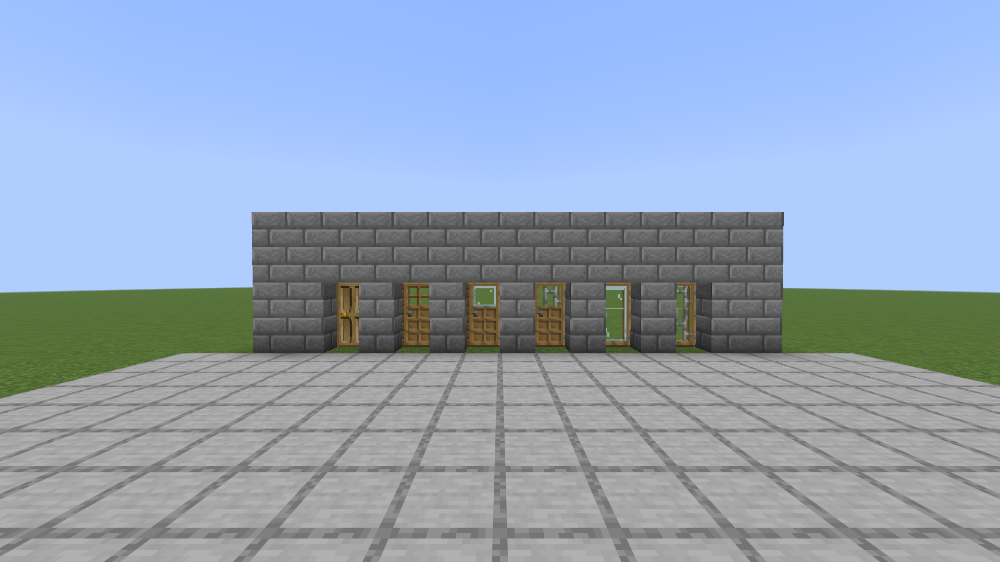
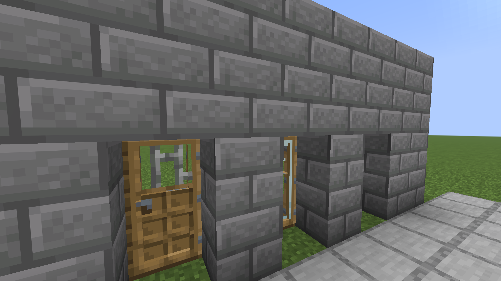

# Moredoor

Doors with depth, doors that lock, doors that swing together, and the same six variants for every
wood in the game.

## Screenshots

## Doors Are Not Flat

Vanilla's door is one slab three pixels thick with a picture painted on it. These are the same eight
shapes rebuilt: a frame standing proud of a recessed panel, and a handle that sticks out far enough
to cast a shadow.

**Every door in the game gets it**, not only this mod's. The eight shapes are vanilla's own, served
above vanilla's copy, and every door - the twenty-two the game ships and the seventy-eight here - is
drawn from them. A resource pack that retextures doors still retextures all of them.

## Six Doors Per Wood, And Vanilla's Beside Them

Vanilla is inconsistent here and always has been. An oak door has windows, a spruce door has iron
banding, an acacia door has slats, a cherry door has blossom cutouts. Which one you get is a fact
about the tree rather than a choice, so a builder who wants a solid oak door and a glazed cherry one
cannot have either.

So the shape and the wood are separated. Every wood offers:

| variant | shape | recipe |
| --- | --- | --- |
| **solid** | dark oak's four panels, in this wood | six planks - the ordinary recipe |
| **classic** | oak and iron's windowed shape | five planks, middle left out |
| **glass** | one window, glazed | five planks and a glass pane in the gap |
| **barred** | one window, barred | five planks and iron bars in the gap |
| **full glass** | glazed the whole way down (doors only) | three planks and three panes, side by side |
| **full barred** | barred the whole way down (doors only) | three planks and three iron bars, side by side |

Trapdoors come in the first four. A trapdoor is too short for a window to be anything but all of it,
so a full-height one would only be the glass or barred trapdoor again. Full ones made before this
still stand and still work; they are made no more, the stonecutter turns one into the glass or
barred trapdoor it duplicated, and breaking one gives that trapdoor back.

The shape of a door is decided by what you leave out of it. Six planks is a door with no opening;
take one out of the middle and you get the opening; put glass or bars where you took it from and the
opening is filled. Put three down one side instead and it runs the height of the door.

**Solid is the default**, and the plain six-plank recipe is written over vanilla's own to make it so.
A door is a thing you cannot see through - that is most of the point of a door - so the shape that
shuts properly is the one you get without asking for anything else.

**A solid door keeps the light out.** A solid door or trapdoor stops light through the face it
covers, the way a slab does through its half, so a shut one leaves the room behind it dark. Vanilla
lets light through every door it has, iron included, and so does every variant here with an
opening in it.

**Where a wood already owns a shape, it keeps it exactly.** Dark oak's solid door and oak's classic
door are pixel-for-pixel the vanilla blocks, not near-misses - which matters precisely because those
are the two that will be stood next to the originals.

**The wood's own vanilla face is still there**, and it is still vanilla's block: a copy would
duplicate vanilla for eleven woods and duplicate two of the variants above for the other two, and it
would gain nothing, because the locking, the door banks and the three-dimensional models in this mod
all reach vanilla's doors already. The stonecutter cuts a wood between its solid, classic and vanilla
faces in any direction, which is how a vanilla-faced door is still had once the plain recipe stops
making one.

### Where the artwork comes from

None of it is drawn by hand. Vanilla drew both shapes already, so each is taken as it is and only the
colour is changed - mapped by brightness, darkest source pixel to darkest colour in the target wood,
so the shading the vanilla artist put there survives and only the timber underneath it swaps.
Handles, hinges and banding are left alone: a brass handle is brass on every wood, and iron banding
is iron.

**The glazed variants cut the cross out.** Vanilla's window is four small panes with a wooden cross
between them, which is right for a door with holes in it and wrong for a glazed one - nobody puts
four postage stamps of glass in a door and leaves the timber standing between them. The cross comes
out and the four become one. A door glazed the whole way down is scaled as a single sheet across
both halves, too, because two panes stacked leave an edge across the middle of the door.

**The bars are vanilla's, cropped rather than redrawn.** Iron bars are two pixels wide on a
five-pixel pitch with cross-braces at matching intervals, and all of that is what makes them read as
iron bars rather than as stripes. The texture is read at its native scale and only nudged sideways,
by the one pixel that lands a bar against the edge of the opening instead of half a bar.

**Woods only.** A metal door is not a wood door in a different colour - iron opens on redstone and
copper oxidises, and neither behaviour survives being restyled - so the metals keep their vanilla
doors untouched.

## Locked Doors

Right-click any door with an iron ingot and it is locked, the ingot spent: visually identical, and
it opens for its owner and nobody else. The owner can let others in with `/doors allow <player>`
while looking at it, take that back with `/doors deny <player>`, and `/doors unlock` gives up the
lock entirely. Operators are always let through, and can use all three on anybody's door.

**A bank locks as a whole**, because half a locked gate is a gate: the unlocked leaf beside the
locked one is simply the way in. And a locked door cannot be broken by anyone it would not open
for - without that the lock is a suggestion, and anybody refused at the handle just takes it off its
hinges.

## A Door Is Made Of Squares

A door block is two squares with their joining and their hinge encoded in it, and that is the
whole model: build squares into a rectangle and you have built a door. Squares of one kind, hung on
the same side, standing in a full rectangle are one door, whatever its size. A leaf placed against a
door takes the door's hinge, so a door grows the way it was started, and a leaf that breaks the
rectangle - one missing from a corner, one hung the other way - is a door of its own.

**Sneak while placing** a leaf against a door and it hangs the way vanilla would hang it, which
beside one door is on the other side: a double door, two leaves meeting in the middle. The two are
two doors, each swinging about its own hinge, and they open together the way any doors standing
side by side do.

**Sneak and right-click a door with an empty hand** to change how it moves. Two rows of pictures,
the one it is now lit and the words for each under the pointer. The top row is the block seen from
above with you at the bottom of it: a leaf along the near edge or the far one, hung from its left
corner or its right, the four corners a door can hang from. The bottom row is a leaf sliding left,
right, up or down, and beside them one more that moves the door to the other face of its block: a
slide pulled to the far edge instead of the near, a hinged leaf swung the other way about the same
corner. The answer is for the whole door.

When other leaves stand against the one clicked, two buttons below, each shown when it applies,
and both when both do. A leaf that is part of a door with them can be disconnected: a cut-loose leaf is a door of its own, opening,
swinging and drawn with its own frame whatever the leaves beside it agree on, and nobody's click on
the leaves beside it reaches it. That is for a leaf that must stay put; a double door does not need
it. When leaves stand together with it that are not part of its door - cut loose, hung another
way, facing the other way, put in turned a quarter round - autoconnect: every leaf standing together there is closed,
turned and hung the way the biggest door among them hangs, and joined into one door, if together
they make a rectangle.

Doors hang from a side. Hanging from the top or the bottom is what a trapdoor is, and trapdoors
stay trapdoors.

Operators can also hang a door without the menu: `/doors hang <pos> <swing>`, the swing one of
`left`, `right`, `slide_left`, `slide_right`, `slide_up` or `slide_down`, for the whole door at
that position.

**A sliding door goes along its own plane by its own size:** sideways like a barn door, up like a
shutter, or down into the floor. It stays a door the whole way, so a slid door is drawn and walked
through exactly as a closed one standing there. It needs the space it slides into to be clear: a
door set into a doorway has wall on every side and cannot slide anywhere, so hang a sliding door on
the face of the wall instead, the way a barn door hangs, or leave it a pocket. A slide with nowhere
to go stays put and says so.

**A wide door swings as a door.** Blocks turn about their own edge and nothing else, which is why a
wide door made of blocks never read as one. So a door wider than one leaf is moved when it swings:
it hangs from its hinge column, and every other leaf goes to the block it really sweeps to, the same
distance out from the hinge as it stood along the wall. Collision, light and the way through all
agree with what is drawn. It goes a column at a time from the hinge, the outermost coming back
first, and a sliding door travels a block at a time, so the bigger the door the longer it takes. A
door that swings into something goes as far as that and bounces back:
the leaves before the obstruction go out, the struck block sounds and sheds dust, and a moment later
the door is closed again. A door one leaf wide swings in place, exactly as it always did, so a
vanilla door is unchanged.

**Doors side by side open together.** Touching, standing in the same line and the same block: a
double door is two doors everyone already treats as one, and a gatehouse can be a row of them. A
pair built from opposite sides of the same doorway faces two ways and still opens as one, each leaf
swinging its own way; a door in the wall at right angles is a door of its own. The leaf you click
makes the sound; the rest come along quietly. A door beside an iron one is two doors that
happen to be adjacent, and opening the iron one because somebody opened the oak one would be a way
through a locked gate.

A door can be tall as well as wide. A door stands on a door here, which vanilla never allowed:
sneak and place one on the top of another and it takes.

**Trapdoors in a rectangle are one trapdoor.** Trapdoors of one kind lying at the same height, or
standing open against the same wall, and filling a rectangle, are drawn as one hatch or one
shutter: the frame round the outside, the sheet's interior stretched across the inside. No new
block and nothing to set up; lay them and they join.

They open together too, floor hatches and wall shutters alike, with one sound between them:
trapdoors of one kind, touching, at the same half of their blocks and hung across the same gap. A
pair of cellar doors meeting in the middle faces two opposite ways and still opens as one hatch.
Iron trapdoors are still opened by redstone, not by hand. **Sneak and right-click a trapdoor with
an empty hand** to re-hang it: which edge it hinges from, named as you see it with the near edge at
your feet, and whether it sits at the top or the bottom of its block. Vanilla fixes both at placing.
The answer is for the whole hatch, closed, and reaches only the trapdoors hung the same way.

**Drawn as one door.** The frame goes round the outside: stiles down the rectangle's edges, rails
along its top and bottom, and one handle, at the swinging edge of the bottom row at the height a
handle sits on any door. Inside it the sheet's interior is stretched across each leaf and its
panels repeat, so a two-by-two bank of oak doors reads as one tall wide oak door rather than four
small ones. Every leaf but the one with the handle is drawn from a copy of its sheet with the
painted handle taken off - found by being the one thing on the swinging side that the hinge side
of the same row never shows, so grey, brass, lighter wood and darker wood all count - and filled
from the wood beside it. Pandorical clients see it; vanilla clients see the leaves.

**Redstone reaches the whole door.** A signal at any square opens or closes all of it. A leaf
that has moved away from its lever cannot hear it switch off, so power a door at the column that
stays put - the hinge column - or take the signal to where the door is when open.

## Doors Connect To Fences

A fence line running into a gate used to stop a block short, with a post standing on its own beside
the doorway. Fences now treat a door as something to connect to, so a fenced enclosure
with a gate in it reads as one continuous line.

Where a fence meets a door, the door gets a jamb: a post at its edge where the fence arm
arrives and two short rails across to the panel, in the planks of the door's wood and cut from
the same strips of them a fence is, so beside a fence of that wood it reads as the fence
carried on. It stands as tall as the fence: a fence one high jambs the lower half only, and a
fence stacked two high jambs both. Without it the arm stopped a half block short of the panel
and the gap showed. Pandorical clients see it; vanilla clients see the gap.

## Large Gates

Fence gates side by side, or stacked, open as one: use any gate in the block and the whole
block takes its state, facing away from you the way a single gate does. On Pandorical clients a
row is drawn as one wide gate, the shared posts gone and the bars running through, each end
swinging from its own remaining post with a clear span between; a stack is drawn as one tall
gate, the posts running the whole height rather than stopping at every storey.

**Sneak and right-click a gate with an empty hand** for the same kind of menu a door has: one leaf
from the left post, one from the right, or the two the game gives it, left and right as you see
them. A tall gate is hung as one, every storey the same way. A gate with another beside it opens
from the middle and says so. Pandorical clients draw the single leaf; vanilla clients see the gate
the game draws.

## Turning A Door In Place

Shift-right-click a door with an axe to cycle its hinge and facing without breaking it. Getting a door's
orientation right otherwise means breaking it and replacing it until it lands the way you wanted,
which for a locked door means losing the lock. Vanilla iron doors take a pickaxe instead, because
that is what you would reach for.

## Pandorical

Moredoor registers its door blocks and the depth models through Pandorical's content sync, and
requires Pandorical 1.3.9 or later on the server.

**The Pandorical mod must be installed client-side** to see the depth, the locks' models, the
joined gates and the jambs, and to open the sneak right-click menus for doors, trapdoors and gates.
Without it the doors still open, lock and open together, but a client sees them as flat vanilla
doors.

## Development

Installing and the art pipeline are in [DEVELOPMENT.md](DEVELOPMENT.md).

## License

MIT, see [LICENSE](LICENSE).
